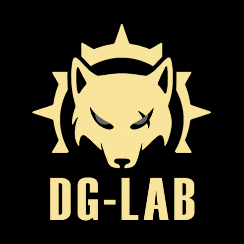

# DG-LAB 开源
DG-LAB设备在全球范围得到广大朋友的认可与喜爱.很多朋友们希望我们的设备可以参与到更多的场景中去,为此我们将DG-LAB 具有代表性的设备蓝牙协议以开源的形式分享出来，您可以通过无数种其他编程的方式将DG-LAB设备参与到您自己的娱乐场景中去.

> 开源蓝牙协议旨在让DG-LAB爱好者更加自由的使用设备，未经授权请勿将本内容用以任何商业用途,如有需要,请[联系我们](https://www.dungeon-lab.com)

## 郊狼情趣脉冲主机

[蓝牙协议V2](coyote/v2/README_V2.md)

[蓝牙协议V3](coyote/v3/README_V3.md)

[SOCKET控制协议V3](socket/README.md)

[郊狼WEB蓝牙直连测试](coyote/web/README.md)

[脉冲波形解释](coyote/extra/README.md)

2024/05/13 -> 更新郊狼WEB蓝牙直连测试

2024/04/25 -> 更新脉冲波形的部分解释

2024/04/24 -> 更新V3版本的SOCKET控制功能相关代码和规则

2024/01/11 -> 更新V3版本的通道强度和波形输出相关协议

V3配件玩法相关内容以及开源形式正在修订中

技术咨询QQ：3849540080（仅供开源相关问题咨询）
